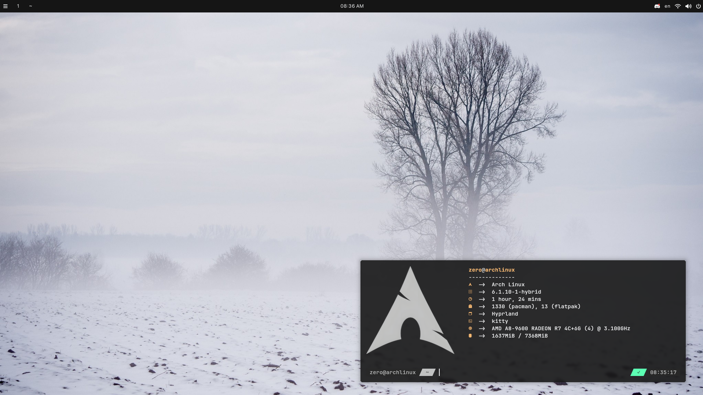
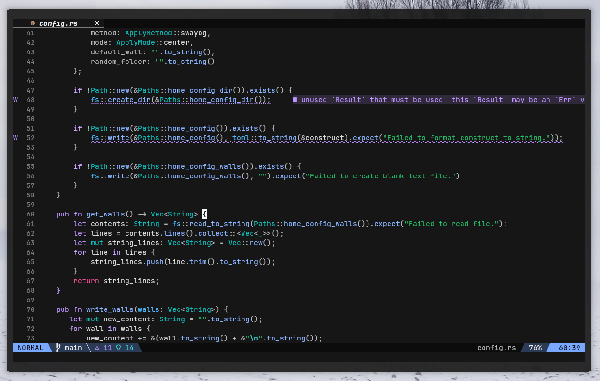
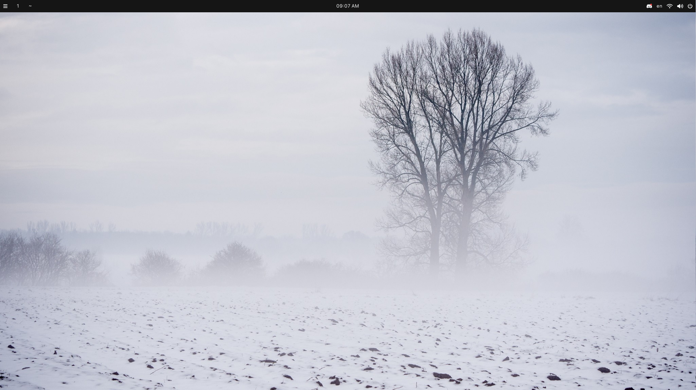
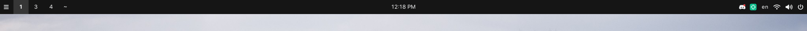

<div align="center">
    <h1><b>zero.dots</b></h1>
    <h3 style="font-size: 20px">Dot files that I use in my workspace.</h3>
    
</div>

## Welcome to my *dots*

This repository contains my own dot files for Hyprland and other applications/tools that I use.
If you have any suggestions you can tell me by contacts in my profile readme.

- **OS** - ArchLinux
- **WM** - Hyprlnad
- **Terminal** - kitty
- **Shell** - fish + fisher (package manager for fish)
- **Prompt** -  zeroPrompt
- **Desktop Font** - SF Pro Display
- **Terminal Font** - JetBrainsMono Nerd Font
- **Cursors** - Simp1e-Adw
- **Icons** - Colloid
- **Kvantum Theme** - MateriaDark
- **SDDM Theme** - Chili for Plasma
- **File Manager** - Dolphin
- **Text Editors** - Kate, Neovim
- **Music Player** - ncspot

## Setting up Neovim

<div align="center">
    
</div>

### Setup package manager

In my neovim setup I use [packer.nvim](https://github.com/wbthomason/packer.nvim) as package manager.
You need to install it first before copy-pasting my Neovim configs.

```shell
git clone --depth 1 https://github.com/wbthomason/packer.nvim\
 ~/.local/share/nvim/site/pack/packer/start/packer.nvim
```

After installation, put configs in `.config/nvim` directory and open Neovim.
You will see several errors but we will fix them right now.
They appears because some plugins are not installed, so we will do this.
Enter command mode and run this:

```shell
:PackerSync
```

To add/remove new packages open `lua/packages.lua` and add a new entry inside `require("packer")`:

```lua
use("username/repository")
```

### Setup LSP server

After this restart your Neovim and you will have working environment.
But we haven't working LSP. It's because we need to install dependencies.
In my configuration I use mason.nvim as package manager for LSP servers, formatters and etc.

To add new LSP servers open `lua/lsp/config.lua` file and add new lines.

```lua
require("lspconfig")[<lsp_server_name>].setup {
    capabilities = capabilities
}
```
Replace `<lsp_server_name>` which you want to use.
To make them work, you need to check which dependencies need. You can check that [there](https://github.com/neovim/nvim-lspconfig/blob/master/doc/server_configurations.md).

### Setup tree-sitter

Only you need to do is to install `tree-sitter` and in Neovim run `:TSUpdate`

### Shortcuts

- `nt` - Toogle Nvim Tree.
- `nc` - Close Nvim Tree.
- `to` - Open new tab.
- `tc` - Close tab.
- `tp` - Go to previous tab.
- `tn` - Go to next tab.

## Setting up Hyprland

<div align="center">
    
</div>

### !! WARNING

Most of options in my config are **PLATFORM SPECIFIC**.
That means you need to setup it for your own platform.
Do not just stupidly copy-pasting config.
Read it line-by-line and check Hyprland Wiki.

### Monitors setup

I have 2 monitors and I setup to make them working with my setup (line 1-2).

```ini
monitor=DVI-D-1, 1920x1080@75, 0x0, 1
monitor=HDMI-A-1, 1920x1080@75, 1920x0, 1
```

Go to the [Hyprland Wiki Monitors configuration](https://wiki.hyprland.org/Configuring/Monitors/) section for better explanation.

### Autostart

In my config I added `easyeffects`, `waybar`, `mate-polkit` and `waller` (line 3).

```ini
exec-once=nohup easyeffects --gapplication-service & waybar & /usr/lib/mate-polkit/polkit-mate-authentication-agent-1 & mako & waller apply 0
```

### Keyboard input

I have English (US) and Russian layouts. Caps Lock configured as layout switcher (line 6-7).

```ini
kb_layout = us,ru
kb_options = grp:caps_toggle
```

### Keybinds

#### Default keybinds

- Mod key is `SUPER`.
- `MOD` + `Return` - run kitty.
- `MOD` + `E` - run dolphin.
- `MOD` + `D` - run rofi launcher.
- `MOD` + `Q` - kill active window.

#### Media keybinds

> Note: this keybinds requires `playerctl`.

- `XF86AudioNext` - Play next track.
- `XF86AudioPrev` - Play previous track.
- `XF86AudioPlay` - Play-pause track.
- `XF86AudioStop` - Stop track.

## Setting up Waybar

<div align="center">
    
</div>

### Keyboard

To allow Waybar correctly showing current keyboard layout you need to give them a name of keyboard that you are using.
You can do it with `hyprctl devices` and in category `keyboard` find your keyboard ID.
Then replace old one with new (line 24).

```json
"keyboard-name": "by-tech-usb-gaming-keyboard"
```

### Network indicator

You need to specify which device is network device.
to find them, use `inxi -N` to get all your network devices.

```
Network:
  Device-1: Realtek RTL8111/8168/8411 PCI Express Gigabit Ethernet
    driver: r8168
```

> In my situation it give me this output.

Then you need to grab a driver name and with `grep` get network device name in `dmesg`.

```shell
sudo dmesg | grep "<driver_name>"
```

Then in output find your device name and paste it in config (line 61).

```json
"interface": "enp5s0",
```
