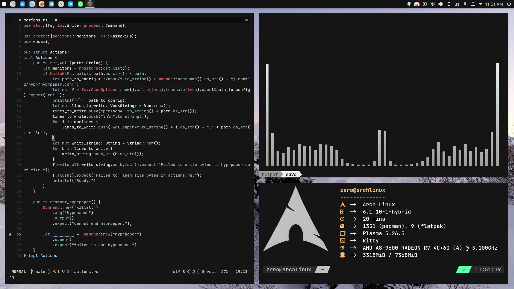

    <h1>zero.dots</h1>
    Dot files that I use for my workspace.
    

# Welcome to my *dots*

This repository contains my own dot files for KDE Plasma and other applications/tools that I use.
If you have any suggestions you can tell me by contacts in my profile readme.

- **OS** - ArchLinux
- **DE** - Plasma
- **WM** - KWin
- **Terminal** - kitty
- **Shell** - fish + fisher (package manager for fish)
- **Prompt** -  zeroPrompt
- **Desktop Font** - SF Pro Display
- **Terminal Font** - JetBrainsMono Nerd Font
- **Plasma Style** - Materia
- **Cursors** - Simp1e-Adw
- **Icons** - Colloid
- **Kvantum Theme** - MateriaDark
- **SDDM Theme** - Chili for Plasma
- **File Manager** - Dolphin
- **Text Editors** - Kate, Neovim
- **Music Player** - Elisa, ncspot
- **KWin Scripts** - AutoCompose, Krohnkite
